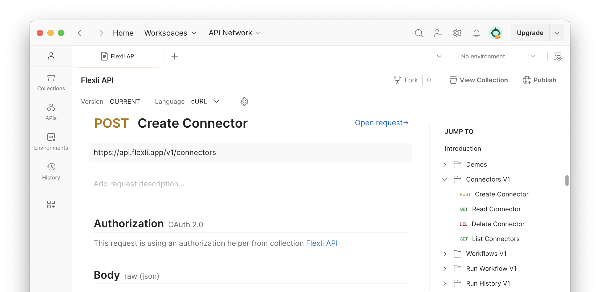

# API Quickstart

The OpenAPI documentation can be viewed at [API Docs](https://brysontyrrell.github.io/flexli-engine/api).

??? info "If you are just getting started check out the [Tutorial](tutorial.md) for creating your first connector and workflow."

## Authentication

The Flexli API uses OAuth2 client credentials flow to issue access tokens.

=== "HTTP"

    ```http
    POST https://auth.flexli.app/oauth2/token HTTP/1.1
    Content-Type: application/x-www-form-urlencoded
    
    grant_type=client_credentials&client_id={{client_id}}&client_secret={{client_secret}}
    ```

=== "cURL"

    ```shell
    client_id=''
    client_secret=''
    
    curl --location --request POST "https://auth.flexli.app/oauth2/token" \
        --header "Content-Type: application/x-www-form-urlencoded" \
        --data-urlencode "grant_type=client_credentials" \
        --data-urlencode "client_id=${client_id}" \
        --data-urlencode "client_secret=${client_secret}"
    ```

=== "Python"

    ```python
    import requests

    client_id = ""
    client_secret = ""
    
    response = requests.post(
        url="https://auth.flexli.app/oauth2/token",
        headers={"Content-Type": "application/x-www-form-urlencoded"},
        data={
            "grant_type": "client_credentials",
            "client_id": client_id,
            "client_secret": client_secret
        }
    )
    print(response.json()["access_token"])
    ```

The access token will be in the response JSON's `access_token` key. Pass this into the `Authorization` header using the `Bearer` scheme for all requests.

```text
Authorization: Bearer {{Access Token}}
```

## Postman

A Postman Collection is provided [here](https://github.com/brysontyrrell/flexli-engine/blob/main/resources/postman/Flexli%20API.postman_collection.json). Import into Postman and paste your client ID and secret into the variables tab.

!!! note "Postman does not support JSON autocompletion using schemas. You can [use an editor](./authoring/editors.md) to write your workflows before sending them with Postman."


