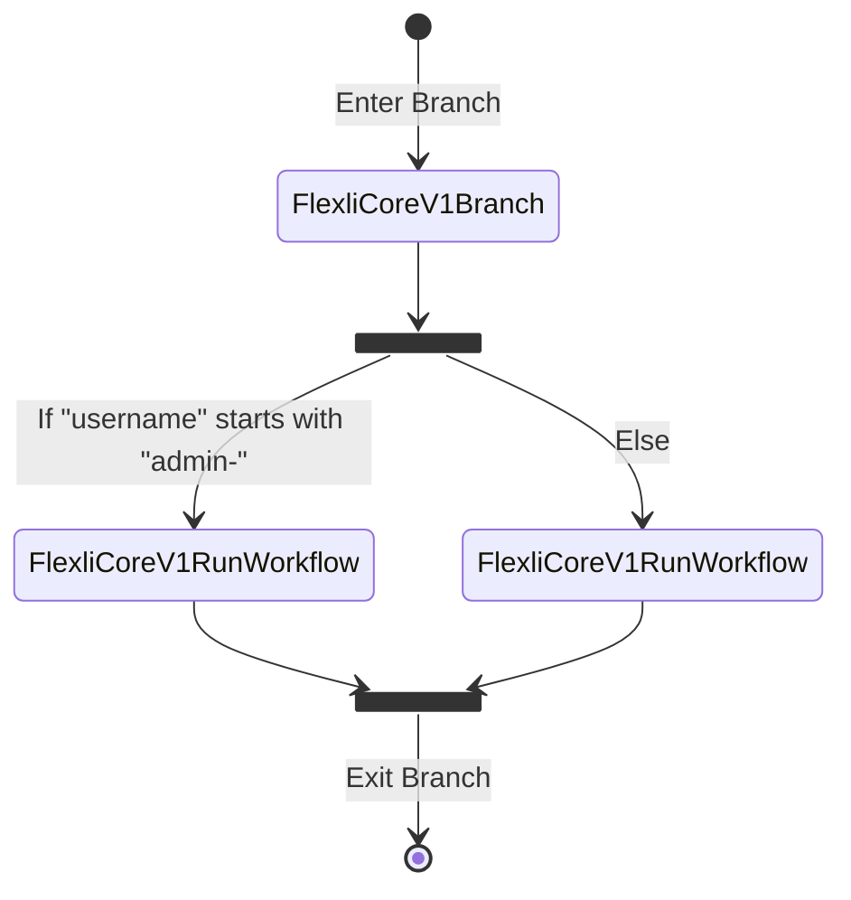

# Core V1 Resources

Flexli Engine provides built-in functionality for connectors and workflows.

## Events

### `Flexli:CoreV1:CustomEvent`

Trigger a workflow in response to a custom event (a [`Flexli:CoreV1:CustomEvent`](#flexlicorev1customevent-1) action).

```json title="Example Usage"
{
  "source": {
    "type": "Flexli:CoreV1:CustomEvent",
    "parameters": {
      "event_type": "<CustomEventType>"
    }
  }
}
```

### `Flexli:CoreV1:Schedule`

Run a workflow on a time based schedule. You have the option of specifying a `cron` job syntax or a `rate` based syntax. This workflow will continue to run on its schedule as long as it is enabled.

```json title="Example Usage"
{
  "source": {
    "type": "Flexli:CoreV1:Schedule",
    "parameters": {
      "rate": "1 minute"
    }
  }
}
```

## Actions

### `Flexli:CoreV1:CustomEvent`

Emit a custom event that can be used to trigger other workflows (see [`Flexli:CoreV1:CustomEvent`](#flexlicorev1customevent) event).

```json title="Example Usage"
{
  "actions": [
    {
      "type": "Flexli:CoreV1:CustomEvent",
      "order": 1,
      "parameters": {
        "event_type": "<CustomEventType>",
        "content_type": "application/json",
        "body": "{}"
      }
    }
  ]
}
```

### `Flexli:CoreV1:Data`

The data action allows you to write, read, query and increment/decrement values to an internal key-value store in Flexli Engine. Use the data store to cache data external to a workflow run, across runs of the same workflow, or across your entire account (accessible within any workflow). The data store is accessible via the _**Data API**_ so values can be retrieved outside of workflows by an administrator.

The `scope` of the action controls where the data is accessible:

* **account**: The key is visible to any workflow run within your account.
* **workflow**: The key is visible to any workflow run that is for the same workflow ID.
* **run**: The key is visible only to the workflow run it was originally written from.

The `read` and `write` operations work against an exact key name within the selected scope. The `query` will return an array of results where the key _starts with_ the given value.

The `increment` and `decrement` operations only work with integers. You can have an atomic counter in the data store that you can increase or decrease by the amount given.

!!! note "Data operations do not support selective updates. Writes will replace the entire value of an existing key."

!!! warning "The data store will only keep items for 30 days from the last update to the key."

```json title="Function Options"
{
  "type": "Flexli:CoreV1:Data",
  "parameters": {
    "operation": "read | write | query | increment | decrement",
    "scope": "account | workflow | run",
    "key": "value | expression",
    "value": "value | expression"
  },
  "variables": {
    "<name>": "value | expression"
  },
  "transform": {
    "<key>": "value | expression"
  }
}
```

### `Flexli:CoreV1:Email`

!!! info "Planned."

### `Flexli:CoreV1:Iterator`

The iterator allows you to loop over arrays within your state and act on the items sequentially. The iterator does not support parallel operations. The content of an iterator can be a full nested workflow with any action _**except**_ for another iterator. Use this action in conjunction with the `Flexli:CoreV1:CustomEvent` or `Flexli:CoreV1:RunWorkflow` actions for more complex and multi-stage workflows.

```json title="Example Usage"
{
  "actions": [
    {
      "type": "Flexli:CoreV1:Iterator",
      "order": 1,
      "parameters": {
        "array_path": "::array",
        "actions": []
      }
    }
  ]
}
```

### `Flexli:CoreV1:Branch`

A branch action defines different paths your workflow may take based on conditions in your state. Each branch can be a full nested workflow with any action _**except**_ for another branching action. Branches allow for conditional operations within your workflows and avoiding sequences of actions when conditions are not met.

```json title="Example Usage"
{
  "actions": [
      {
        "type": "Flexli:CoreV1:Branch",
        "order": 1,
        "parameters": {
          "branches": [
              {
                "order": 1,
                "condition": {
                  "criteria": [
                      {
                        "attributes": [
                          {
                              "type": "String",
                              "attribute": "::username",
                              "operator": "starts_with",
                              "value": "admin-"
                          }
                        ]
                      }
                  ]
                },
                "actions": [
                  {
                      "type": "Flexli:CoreV1:RunWorkflow",
                      "order": 1,
                      "parameters": {
                        "workflow_id": "<WorkflowId>",
                        "workflow_version": 1,
                        "workflow_input": "::"
                      }
                  }
                ]
              },
              {
                "order": 2,
                "actions": [
                  {
                      "type": "Flexli:CoreV1:RunWorkflow",
                      "order": 1,
                      "parameters": {
                        "workflow_id": "<WorkflowId>",
                        "workflow_version": 1,
                        "workflow_input": "::"
                      }
                  }
                ]
              }
          ]
        }
      }
  ]
}
```

Branches are evaluated according to the `order` (just like action arrays). The first branch to evaluate `true` will execute and the rest will be skipped. In the example above the first branch will execute if the `username` field in the state begins with `admin-`. The second branch has no condition and acts as a catch-all (a programmatic `else`).



### `Flexli:CoreV1:RunWorkflow`

Run another workflow.

```json title="Example Usage"
{
  "actions": [
    {
      "type": "Flexli:CoreV1:RunWorkflow",
      "order": 1,
      "parameters": {
        "workflow_id": "<WorkflowId>",
        "workflow_version": 1,
        "workflow_input": "::"
      }
    }
  ]
}
```

### `Flexli:CoreV1:Transform`

Use this action to perform additional transformations on your state between other actions.

### `Flexli:CoreV1:Wait`

This is a sleep state. You can introduce a pause for a given number of seconds in your workflows. The intent of this action is to provide a means for artificial waits between other actions in the event immediate back-to-back calls can result in stale data or race conditions.

```json title="Example Usage"
{
  "actions": [
    {
      "type": "Flexli:CoreV1:Wait",
      "order": 1,
      "parameters": {
        "seconds": 3
      }
    }
  ]
}
```

## Expression Functions

These functions are an extension of the standard JMESPath functions to allow more manipulation of state data without having to run custom code. Call Flexli functions anywhere expressions are supported.

### `flexli_datetime_now`

Return an ISO 8601 timestamp for the current time in UTC in this format: `%Y-%m-%dT%H:%M:%SZ` / `2024-01-01T12:00:00Z`.

```json title="Usage Example"
{
  "result": "::flexli_datetime_now()"
}
```

```json title="Result"
{
  "result": "2024-01-01T12:00:00Z"
}
```

### `flexli_datetime`

Return a timestamp for the current time in UTC using a provided format string (e.g. `%Y-%m-%d %H:%M:%S`).

```json title="Example Usage"
{
  "result": "::flexli_datetime(`%Y-%m-%d %H:%M:%S`)"
}
```

```json title="Result"
{
  "result": "2024-01-01 12:00:00"
}
```

### `flexli_time_delta`

Return a timestamp using a provided format string offset by a given number of minutes (positive or negative).

```json title="Input State"
{
  "timestamp": "2024-01-01T12:00:00Z"
}
```

```json title="Usage Example"
{
  "result": "::flexli_time_delta(::timestamp, `%Y-%m-%dT%H:%M:%SZ`, `-15`) "
}
```

```json title="Result"
{
  "result": "2024-01-01T11:45:00Z"
}
```

### `flexli_diff_arrays`

Compare two arrays from the state and output the differences.

```json title="Input State"
{
  "current": [1, 4, 5],
  "previous": [1, 2, 3]
}
```

```json title="Usage Example"
{
  "result": "::flexli_diff_arrays(::current, ::previous)"
}
```

````json title="Result"
{
  "result": {
    "added": [4, 5],
    "removed": [2, 3]
  }
}
````

### `flexli_random_string`

Generate a random string of a given length using selected character sets: `lowercase`, `uppercase`, and `numbers`.

```json title="Usage Example"
{
  "result": "::flexli_random_string(`12`, `lowercase`, `numbers`)"
}
```

```json title="Result"
{
  "result": "yk4k6iivetz6"
}
```

### flexli_to_json_string

Serialize an object to a JSON string.

```json title="Input State"
{
  "foo": "bar"
}
```

```json title="Example Usage"
{
  "result": "::flexli_to_json_string(@)"
}
```

```json title="Result"
{
  "result": "{\"foo\": \"bar\"}"
}
```
