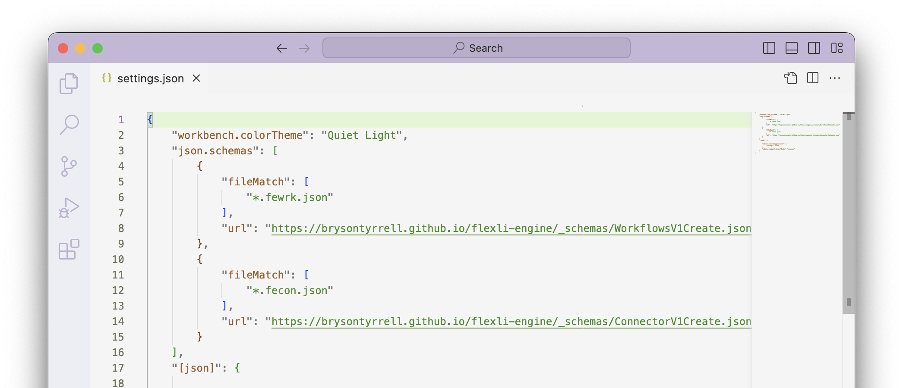

# Working with Editors

Code editors and IDEs support using JSON schemas for validating files as well as auto-completion suggestions while editing. The connector and workflow schemas are available

## Visual Studio Code

When editing connector and workflow definitions in Visual Studio Code you can reference the public schema files for auto-completion. The first method is to set the `$schema` property in your JSON file.

The second method is to edit your `settings.json` to match filenames to the schemas. The screenshot below matches on additional file extension segments. `.fecon.json` files will automatically reference the connector schema and `.fewrk.json` files will reference the workflow schema.

You must first save the file you are working in for this to take effect.

!!! note "These instructions setup auto-completion using the base schemas. This will not present you auto-completion of values for connectors you have created within your account. A feature to support downloading a special schema populated with [snippets](https://code.visualstudio.com/docs/languages/json) is planned."
