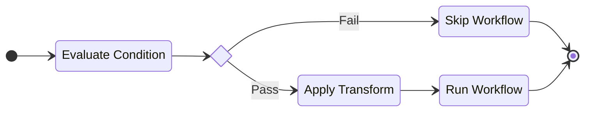
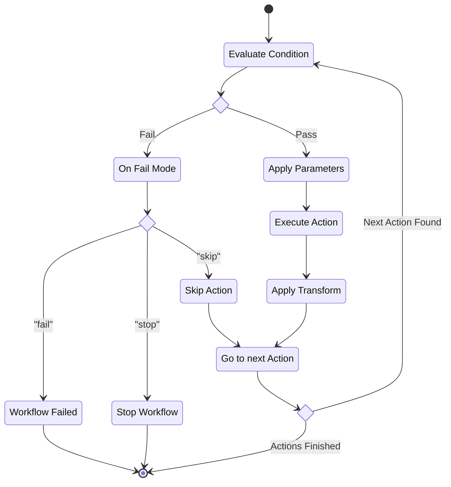

# Authoring Workflows

!!! note "All workflows must set their `schema_version` to `1`."

## State

The state object represents the data available to actions during a workflow run. The initial state will be the data that is passed from the source or API call that triggered the run. State data accessed within a workflow through [_**Expressions**_](expressions.md). State will never mutate unless you explicitly modify it within an action's [_**Transform**_](#transforms).

## Conditions

Use conditions on events and actions to control workflow behavior. A condition is an object with up to 10 criteria that each contain up to 10 attributes that will be evaluated. If the condition fails (results in a boolean `false`) the outcome is controlled by the `on_fail` setting (see below).

```json title="Condition"
{
  "operator": "and | or",
  "criteria": [
    {
      "operator": "and | or",
      "attributes": [
        {
          "type": "Boolean | Date | Number | String | Version",
          "attribute": "expression",
          "operator": "eq | ne | lt | lte | gt | gte | starts_with | before | after",
          "value": "value | expression"
        }
      ]
    }
  ],
  "on_fail": "fail | skip | stop"
}
```

The rules of a condition are simple. The outer operator of the condition is either an `and`, requiring all criteria evaluate to `true`; or `or`, requiring at least one must evaluate to `true`. The same behavior applies to criteria and evaluating the attributes. A condition only succeeds if the resulting evaluation is a boolean `true`.

Criteria attributes evaluate against the workflow state. The `attribute` field _must_ be an expression that references a location in the state. The `value` can be either a constant that matches the `type`, or an expression referencing a location within the state. The `operator` that can be used in the evaluation varies across the different types (see the [api docs](./api) for exact options).

### Failure Modes

If a condition fails on an action the outcome is controlled by the `on_fail` mode:

* `fail`: The workflow stops and is considered in error.
* `skip` The workflow moves on to the next action and does not treat the condition failure as an error.
* `stop`: The workflow stops but is considered complete and not in error.

For events the condition is only used to evaluate if the workflow should be triggered using the initial state provided by the event. If the condition fails the workflow is not triggered for that event. The `on_fail` setting is ignored.

## Using Events

!!! note "Flexli Engine Events are still in development and subject to change."

Workflows can be triggered automatically by defining an event source. As long as the release version of a workflow remains in an enabled state it will run in response to the source. See [Versioning](#versioning) to learn more about releases.

When triggered by an event, the workflow will perform the following lifecycle steps to determine if it will run:



!!! info "Schedules do not support conditions as they do not have a dynamic input."

### Connector Events

Connector events are defined by connectors and can be filtered using _**Conditions**_. These are external events that are processed by the _**Events API**_. To learn more about defining connector events see the [Defining Events](connectors.md#defining-events) doc.

### Schedules

Schedules are time-based triggers. Your schedule can be a cron (`0 20 * * 5`) or rate (e.g. `5 minutes` or `4 hours`) expression. The system will execute your workflow on that cadence as long as it is enabled. Create a schedule using the [`Flexli:CoreV1:Schedule`](core.md#flexlicorev1schedule) event type.

### Custom Events

Custom events are an arbitrary event type not associated to any connector and can be filtered using conditions. These are internal events to your account that allow flexibility in asynchronously triggering workflows or running multiple workflows in parallel from a single event. See [Workflow Strategies](strategies.md) for more about these design patterns.

Subscribe your workflow to a custom event type by using [`Flexli:CoreV1:CustomEvent`](core.md#flexlicorev1customevent). Workflows emit events using the same named [`Flexli:CoreV1:CustomEvent`](core.md#flexlicorev1customevent-1) action type. The `event_type` is an arbitrary string value. Object schemas are not enforced as a part of a custom event flow (this requires a connector). Conditions can still be used to evaluate custom events as a part of a workflow and prevent executions.

## Using Actions

Your workflow defines a series of actions across one or more connectors in response to being triggered.

```json title="Workflow Action"
{
  "connector_id": "<ConnectorId>",
  "type": "<ActionType>",
  "description": "Optional description of the action.",
  "order": 1,
  "condition": {},
  "parameters": {
    "name": "value"
  },
  "variables": {
    "name": "value | expression"
  },
  "transform": {
    "key-path": "value | expression"
  }
}
```

All actions follow the same lifecycle when they are executed within a run:



### Parameters and Variables

Connector actions may have one or more parameters that require input. This is based upon their parameter schema (this is discussed in the [Authoring Connectors](connectors.md) doc). Those inputs can be applied using expressions and formatted strings.

Here is an example action that sends a message to a Slack webhook:

```json title="Example Action Use in a Workflow"
{
  "actions": [
    {
      "connector_id": "<ConnectorId>",
      "type": "PostMessage",
      "order": 1,
      "parameters": {
        "webhook_path": "ESKJ2PLV6/TTIP5QFU9YB/6ybc6x14yuq3u9tase2c77ko",
        "body": {
            "text": "Hello, from Flexli Engine!"
        }
      }
    }
  ]
}
```

The `text` is using a string constant. It can also be taken from the workflow state using an expression:

```json title="Expression"
{
  "parameters": {
    "body": {
      "text": "::name"
    }
  }
}
```

!!! info "The schema for this action requires that the text value be a string. When providing a constant the API will validate the correct data types on create/update requests. When using an expression the API can no longer guarantee the data type passed in from the `::name` expression is a string. The state data can only be known at runtime and this may cause an error."

In the above let's assume the value for `name` is `"Bob"`. A Slack message that just says "Bob" is not very helpful. Here you can use string formatting to pass values from the state as variables into your parameters.

```json title="String Formatting"
{
  "parameters": {
    "body": {
      "text": "Hello, {name}!"
    }
  },
  "variables": {
    "name": "::name"
  }
}
```

The expression for the `name` is not passed into a variable of the same name. In the parameters, the `text` is not a string constant with a format syntax represented by the curly braces (`{name}`). While this is a simple example, you can use use variables multiple times throughout an action's parameters, or use multiple variables within a single formattable string.

### Transforms

The response of an action does not cause any change to the workflow's state. Any additions or changes to state data must be declared at the end of an action in the `transform`. While expressions will reference the state in parameters and variables, when used in transforms they reference the response body of an action that successfully completes.

The key name in a transform is always interpreted as a _key path_ to a location within the state. Any period in the string represents a sub-key being referenced (similar to expressions). Key paths do not support referencing locations in arrays.

In the example below, the key path `a.b` references the inner `b` key and assigns a constant value of `d`. Note that value expressions are evaluated _before_ changes occur to minimize race conditions.

```json title="Input State"
{
  "foo": {
    "bar": "baz"
  }
}
```

```json title="Transform"
{
  "transform": {
    "foo.bar": "qux"
  }
}
```

```json title="Result"
{
  "foo": {
    "bar": "qux"
  }
}
```

A `::` prefix syntax indicates that the string is a JMESPath expression. If a value string does not begin with `::`, or a value is a non-string type, it is processed as a constant.

In the example below, the JMESPath expression `::general.id` references the value of a nested `id` key in an action's response and passes it to a new `id` key in the state.

```json title="Input State"
{
  "foo": {
    "bar": "qux"
  }
}
```

```json title="Action Response"
{
  "user": {
    "id": 1
  }
}
```

```json title="Transform"
{
  "transform": {
    "id": "::user.id"
  }
}
```

```json title="Result"
{
  "foo": {
    "bar": "qux"
  },
  "id": 1
}
```

In state updates dictionaries are merged (any keys not present in the update are preserved) while lists are replaced. This behavior is similar to [JSON Merge Patch](https://datatracker.ietf.org/doc/html/rfc7386).

Setting an empty `::` without any expression will return the full source unaltered at the given key path (this is a shortcut to the equivalent `::@` JMESPath expression). This wildcard behavior is extended to replacing the _entire state_ with the result of the action using `::` for both key and value expressions.

!!! info "*Using `::` for the key is only supported when the value is also `::`. No other updates will be processed if this wildcard is detected!"

```json title="Input State"
{
  "foo": "bar"
}
```

```json title="Action Response"
{
  "baz": "qux"
}
```

```json title="Expression"
{
  "transform": {
    "::": "::" 
  }
}
```

```json title="Result"
{
  "baz": "qux"
}
```

### Callbacks

Not yet supported.

## Controlling Concurrency

Not yet supported.

## Versioning

Workflows are versioned resources. Every update and modification to your workflows will increment the version counter.

### Promoting

Workflows that have a connector or custom event source will only run the designated _**release version**_.
