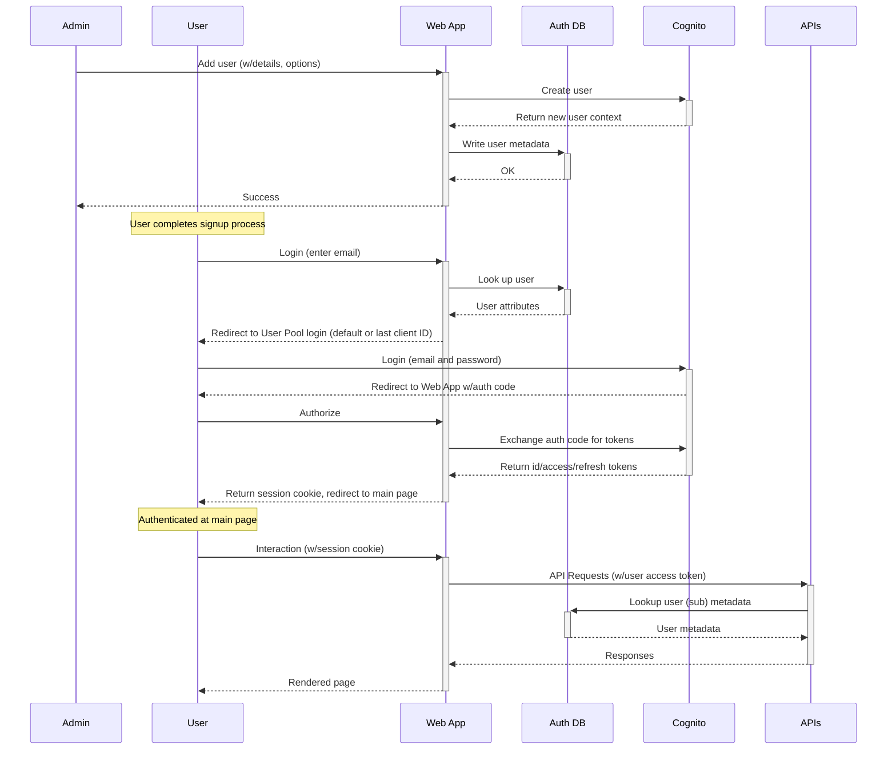
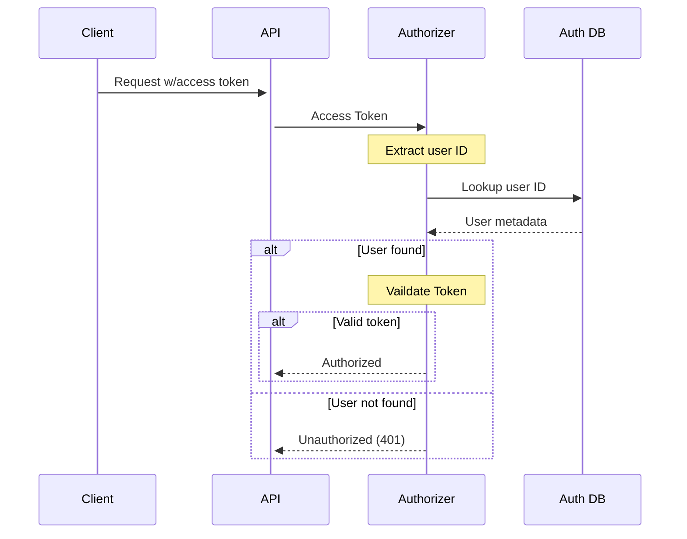

# Auth

Flexli uses a Cognito User Pool per customer (tenant) model.

A new customer is run through a provisioning process that creates their user pool and required attributes/settings within that user pool. Configuration items like password complexity and MFA are admin configurable.

> Paid features may include custom domains and integration with customer provided IdPs through OIDC.

* Admins can add users though the (Auth/IAM?) interface.
* Users can be assigned to groups.
* Users and groups can be granted access to resources and roles.
* Resources represent objects within Flexli (e.g. a connector or workflow).

A role is a collection of API scopes. Roles are an abstraction over Cognito App Clients. These scopes grant access to the different APIs (e.g. `workflows/read` allows any read-only API while `workflows/write` allows any read and write APIs). A user might be granted access to a workflow, but they are limited by the roles available to interact with it (if a user does not have access to a role that grants any workflow APIs they cannot interact with the resource at all!).

A user can only use one role at a time in a session and cannot combine roles. They can switch between their available roles at any time (they will go through the Cognito auth flow again with the selected role/App Client). Available roles are determined by the role assigned to a user plus roles available via group memberships.

Admins can create API clients for programmatic access. These API clients are abstractions over Cognito App Clients using client credentials flow. API clients have explicitly set API scopes. They are not assigned roles and cannot be assigned to groups. API clients must be granted access to any resource they did not create in order to interact with them.

The tenant ID and other metadata for a customer is stored within the Auth DB (a DynamoDB table). API authorizers lookup the `sub` of any access token to retrieve this information and apply it as context.

The customer interactions with the system are illustrated below:

Custom Authorizer:

* Validate token
* Get user metadata
* Set tenant ID from metadata
* Inspect groups:
  * Retrieve group metadata from Auth DB
  * Merge roles and resources with user's
* Validate scopes against requested API
  * 403 if no matching scope found
* Validate resource access
  * 403 if no resource permission matching request

Abbreviated API auth workflow:

